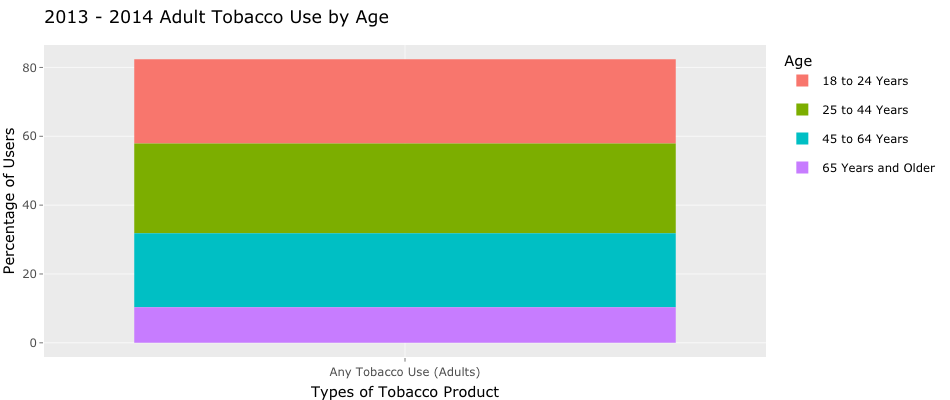

# Summary

## Takeaway 1: There is a decreasing trend of smoking in the US

Surprisingly, according to the first chart, about all of the states in the United States show a decreasing trend of smoking every day rate. As the State Smoking Population Line Graph presented, despite small lifts from time to time, the overall smoking trend in all states decreased from 1995 to 2010. This means fewer and fewer people choose not to smoke daily. What great news！

## Takeaway 2: Adult Tobacco Consumption per person is also on a decreasing trend

As the second graph shows, the total tobacco consumption per capita has decreased significantly from 2000 to 2020. In the year 2000, the total tobacco consumption per capita of adults is around 2100 cigarettes, and 20 years later, in the year 2020, the total tobacco consumption per capita of adults is about 900 cigarettes. Consumption has decreased by more than 1200 cigarettes per year, which is a significant improvement.

## Takeaway3: Most of the Tobacco users are between the aged 18 to 24

The third graph shows that most tobacco users are aged between 18 and 24 and form the most e-cigarette user. Also, we know that cigarette has the most users, E-Cigarette has the second most users, and cigar has the minor users. 
